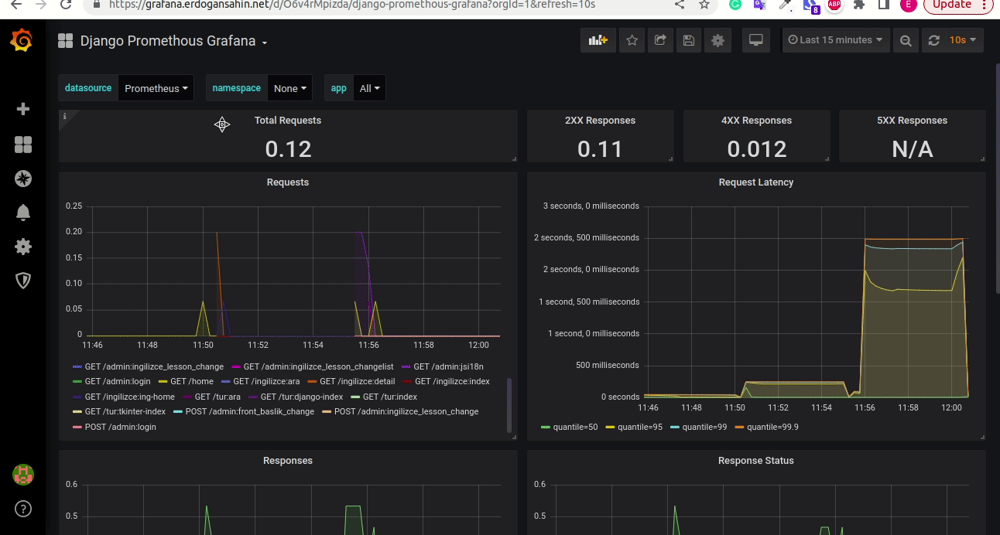

# My Blog and Portfolio
This website contains more than 500 topics and 1000 examples about Python for Turkish and English, its modules and packages. It can be also deployed automatically by using Jenkins and Github-hook. Additionally Requests, responses, requests to databases  can be monitorized by using Promethous and Grafana. Logs can be also seen for the backend and portfolio using promtail and loki.

## Used Technologies

- Python
- Django
- HTML, CSS, Bootstrap and JS
- Docker, Docker-compose
- Jenkins
- Github-hook
- EC2 and Route53 Services
- Promethous
- Grafana
- Loki
- Promtail
- Nginx
- Certbot
- Sqlite3

## Overview

[Blog web site](https://blog.erdogansahin.net/en/python/)

[Portfolio](https://me.erdogansahin.net/)

[Grafana](https://grafana.erdogansahin.net/)

## Contact

[Linkedin](https://www.linkedin.com/in/erdogan-sahin/)

[Github](https://github.com/kopuskopecik)

## License
[MIT](https://choosealicense.com/licenses/mit/)

